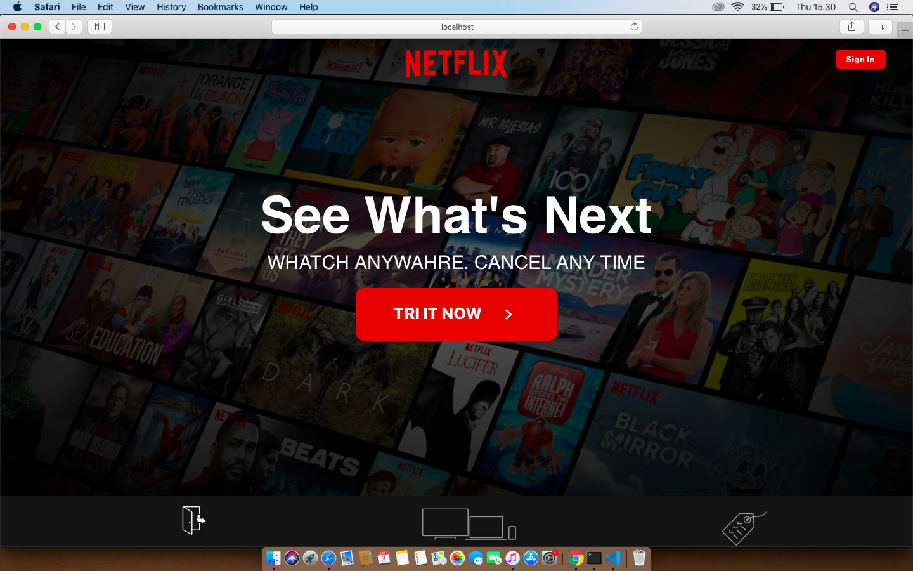

## Important 

This project is still on very early development stage. If you want to use for production, use it with your own risk.
<br>More feature Coming Really Soon.

## Screenshots

<p float="left">
  

  
</p>


## Tech Stack

- React JS 
- React Styled Component
- React Media Query

## Installation & Configuration

follow these steps to install


```bash
git clone https://github.com/ilhamdani97/Clone-Netflix-react.git
cd Clone-Netflix-react
npm start
```

### Support Us :)

- Stars this repository
- Hire Us

  * [Ilham Ramadani](https://www.linkedin.com/in/ilham-ramadani-a38256117/)
  ## Contact

- WA/TELEGRAM: +62 1372374345 (Ilham Ramadani)

## Download App APK (Demo usage only)
 * [BarBar Food](https://drive.google.com/file/d/1_VJjEx89h0bo1A8JakewawCjLrs_zf7K/view?usp=sharing)
